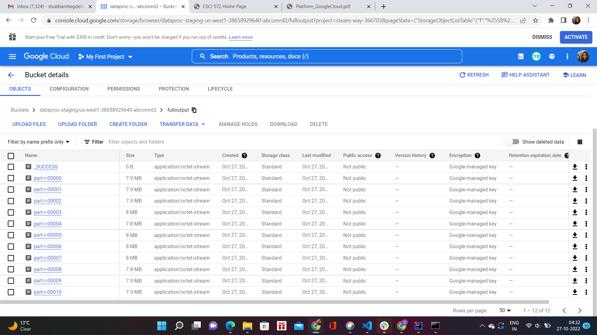

# Search-Engine

## Youtube link : https://youtu.be/T2C7IYOagAE

## Inverted Index
Create inverted index for words and bigrams using a Hadoop job on GCP.

## Search Engine
Steps followed to complete this assignment :
1) Installing Ubuntu and Solr:
* I had already dual booted my laptop and hence already had Ubuntu on my
system.
* Solr Installation : Downloaded Solr 7.7.3 binary from
https://www.apache.org/dyn/closer.lua/lucene/solr/7.7.3/solr-7.7.3.zip?acti
on=download
2) Using Solr:
* cd into solr-7.7.3 folder and entered the command: bin/solr start
* Created a new core ‘hw4’ with the command : bin/solr create –c hw4
* Uncomment the following line - <!-- <copyField source="*" dest="_text_"/>
--> from managed-schema file.
* Downloaded nytimes html pages from
https://drive.google.com/drive/folders/19btQxjLM9EBEXgq2A3-EYR8L7T
GXFTKh?usp=share_link.
* Indexed this by running bin/post -c hw4 -filetypes html
../NYTIMES/nytimes/
* Navigated to http://localhost:8983/solr/ , selected the core “hw4” and tried
the default query (*:*) to see if everything is working fine.
* Uncommented the str element with name “df” in requestHandler in
solrconfig.xml file and specified the default query field to be “_text_”.
* Reloaded core by going to Core Admin on Solr UI and clicking on the
“Reload” button.
3) PHP webpage creation:
* Installed and configured PHP in the Ubuntu System with Apache2 using
the following commands:
sudo apt install php libapache2-mod-php
sudo apt install php-cli
sudo apt install php-cgi
And then restarted the apache server and checked to see if php was
working.
* Cloned solr-php-client repository and used it in the php webpage created
with html.
* Provided radio buttons to toggle between Lucene and Pagerank
(explained in the next part).
4) Working of Pagerank
* Installed intellij and used jsoup library jar. Wrote a Java program which
used hashmap to create edgeList.ext
* Networkx was already downloaded as part of the Anaconda framework.
* Wrote a python script to generate the external_pageRankFile.txt using
networkx and digraph and placed it in solr-7.7.3/server/solr/hw4/data/. The
following parameters were used : alpha=0.85, personalization=None,
max_iter=30, tol=1e-06, nstart=None, weight='weight',dangling=None
* Added pageRankFile external field in managed-schema file. Added
eventListeners within the <query> element in the solrconfig.xml file.
* Navigated to Solr Dashboard UI -> Core Admin and clicked on “Reload”.
* Put the value ‘pageRankFile desc’ in the sort field on solr UI.

Ran all the queries for both the ranking schemes.

### Why some pages have higher PageRank values than others :
PageRank calculates the rank of different web pages based on the number of links to it
from other webpages (incoming links). A page that is linked to by many pages with high
PageRank receives a high rank itself. Basically the pagerank formula will look at the
number of inbound links, external links, and the PageRank of those links to determine
authority of a webpage. Hence, some pages have higher PageRank values than others.
